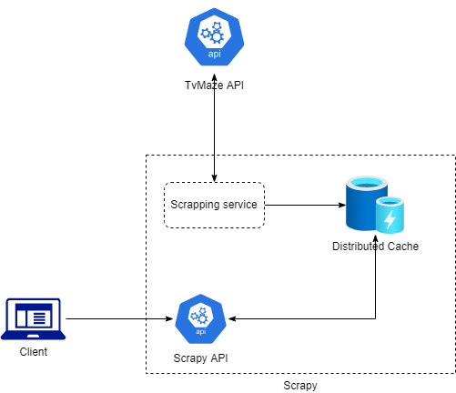

# Scrapy

## About the project

Scrapy is a web-crawling framework written in C#. Originally designed for web scraping shows and casts from TvMaze API, it can also be used to extract data using APIs.

Scrapy is built following the specifications about the endpoints stated in: http://www.tvmaze.com/api

## Built With

- Language: C#
- Framework: .Net 6
- IDE: Visual Studio 2022
- Storage: Microsoft Distributed Memory Cache
- Hosting: Docker, IIS etc
- Hosting service: Using Microsoft hosting extension
- API versioning: Swagger

## Architecture

### Overall Architecture



Scrapy's Scrapper service calls TvMaze API to retrieve shows and cast information and keeps on saving the data in a distributed cache.

Scrapy has an API endpoint which returns paginated data retrieved from a distributed cache upon requesting.

### Project Architecture

#### Scrapy uses Hexagonal architecture.

The general idea behind the hexagonal architecture style is that the dependencies (adapters) required by the software to run are used behind an interface (port).

#### Ports

Ports are interfaces defined by the application that must be implemented by the outside world so that the application can receive or send information.

#### Adapters

An adapter is the implementation of an interface. It is in the external world of the application and can make use of packages, frameworks etc.

#### Scrapy contains below projects:

- `Scrapy.API` is responsible for all endpoints
- `Scrapy` is domain project that contains ports, use cases, models etc
- `Scrapy.Adapters.TvMaze` is responsible for connecting with external TvMaze API
- `Scrapy.Jobs` is responsible for background scheduler that calls TvMaze adapter to scrap the shows and casts
- All above projects has its own test projects to test individual functionalities

## Getting started

### Installation

Run docker build command from root folder:

`docker build -t scrapy.api -f src/Scrapy.Api/Dockerfile .`

And then run using below command:

 `docker run --rm -d -p 5000:80 --name scrapy.api scrapy.api`

Or run the project directly from Visual Studio.

## Rate Limiting

As TVMaze API allows at least 20 calls every 10 seconds per IP address and if the rate is exceeded, API returns HTTP 429 error. Due to this some precautions are required.

In case of getting shows, the limit would not be reached since it is just one call to get all shows on the basis of page index. Limits might be reached in case of getting casts for a show as there is a single call for each show Id.

### Precautions

While scraping, I have included batches of 10 shows in one batch. Because of this 10 API calls would be made at once to limit more calls to be done at a time to get casts.

### Policy for retry

In case if the rate limit is still reached and if TvMaze API returns HTTP 429 error, it is better to back off for sometime and then retry. For this, I have used Polly to implement the retry and wait policy in Program.cs

## Information regarding shows and casts from TvMaze API documentation

### Show index

A list of all shows in our database, with all primary information included. You can use this endpoint for example if you want to build a local cache of all shows contained in the TVmaze database. This endpoint is paginated, with a maximum of 250 results per page. The pagination is based on show ID, e.g. page 0 will contain shows with IDs between 0 and 250. This means a single page might contain less than 250 results, in case of deletions, but it also guarantees that deletions won't cause shuffling in the page numbering for other shows.

Because of this, you can implement a daily/weekly sync simply by starting at the page number where you last left off, and be sure you won't skip over any entries. For example, if the last show in your local cache has an ID of 1800, you would start the re-sync at page number floor(1800/250) = 7. After this, simply increment the page number by 1 until you receive a HTTP 404 response code, which indicates that you've reached the end of the list.

As opposed to the other endpoints, results from the show index are cached for up to 24 hours.

```
URL: /shows?page=:num
Example: http://api.tvmaze.com/shows
Example: http://api.tvmaze.com/shows?page=1
```
Reference: https://www.tvmaze.com/api#show-search

## Show cast

A list of main cast for a show. Each cast item is a combination of a person and a character. Items are ordered by importance, which is determined by the total number of appearances of the given character in this show.

```
URL: /shows/:id/cast
Example: http://api.tvmaze.com/shows/1/cast
```

Reference: https://www.tvmaze.com/api#show-cast

## Future scope

- Add end to end test that triggers the background service -> calls TvMaze API -> Fills the cache -> calls Scrapy end point to retrieve shows
- Currently scraper service runs and calls TvMaze API every time from page 0, I would like to change in the future so that scrapper service calls TvMaze API from the page it scrapped last time to avoid duplication of data
- Expose the logs to more readable format, like splunk
- I have used distributed memory cache to store the shows and cast information which would work even in production if there is only one server and memory is not an issue but for more production ready approach, it can be shifted to Azure Redis cache since it provides higher throughput and lower latency
- containerize testing projects
